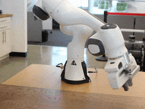
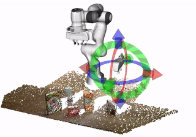

# Motion Policy Networks
This repo has the expert data generation infrastructure and Pytorch implementation of [MPiNets](https://mpinets.github.io/).

   

## Table of Contents

* [Motion Policy Networks](#motion-policy-networks)
   * [Installation](#installation)
   * [Usage](#usage)
   * [Inference With Motion Policy Networks](#inference-with-motion-policy-networks)
   * [Interactive Demo Using ROS](#interactive-demo-using-ros)
   * [Training Motion Policy Networks](#training-motion-policy-networks)
      * [Using our pregenerated data](#using-our-pregenerated-data)
      * [Training the model](#training-the-model)
   * [Data Generation](#data-generation)
      * [Generating Data for Individual Scene Types](#generating-data-for-individual-scene-types)
      * [Data Cleaning](#data-cleaning)
   * [License](#license)
   * [Citation](#citation)
<!-- Created by https://github.com/ekalinin/github-markdown-toc -->


## Installation
The easiest way to install the code here is to build our included docker container,
which contains all of the dependencies for data generation, model training,
inference, and a ROS-based interactive demo. Due to the many components, this
container will require `~30gb` when built.
Despite the sizeable storage requirements, we use Docker for several reasons:

1. For the data generation pipeline, some of our dependencies cannot be
   installed easily via PyPI
   - [OMPL](https://ompl.kavrakilab.org/) requires a lot of system dependencies and then building from source
   - [Nvidia
     Omniverse](https://www.nvidia.com/en-us/omniverse/) has the release of [Geometric Fabrics](https://sites.google.com/nvidia.com/geometric-fabrics) used in our expert generation.
2. Docker makes it easy to manage the entire system environment, e.g. the CUDA
   runtime, the various upstream dependencies, ROS, etc.

If you have a strong need to build this repo on your host machine, you can follow the same steps as are outlined in the [Dockerfile](docker/Dockerfile). For example, if you are limited in disk space and, have your own expert data generation pipeline, or simply intend to use our publicly available datasets, you only need to install the learning dependencies (the different areas should be well-documented in the Dockerfile). Likewise, if you do not intend to use the interactive demo, you do not need to install the ROS dependencies.

If you intend to run the data generation pipeline, you must use Isaac Sim to get access to Geometric Fabrics. Again, you can install this on
your host machine, but we recommend using our included Dockerfile, which streamlines the installation process.

In order to build the Docker container included in this repo, you will need access
to the Isaac Sim docker container (our container is built on top of it). You can find detailed instructioned on how
to do this
[here](https://docs.omniverse.nvidia.com/app_isaacsim/app_isaacsim/install_advanced.html#isaac-sim-app-install-advanced),
but we provide summarized instructions here as well.

First you will need to join
the [Nvidia Developer Program](https://developer.nvidia.com/developer-program).
After joining, you can generate your NGC API key [as described here](https://docs.nvidia.com/ngc/ngc-overview/index.html#generating-api-keyget).

With your NGC API key, you must log in to NGC from your host computer. As your
username, use the string `$oauthtoken`. As your password, use your NGC API key.
To log in, use the command
```
sudo docker login nvcr.io
```
Next, clone this repo using:
```
git clone https://github.com/NVlabs/motion-policy-networks.git
```
Navigate inside the repo (e.g. `cd motion-policy-networks`) and build the docker with
```
docker build --tag mpinets --network=host --file docker/Dockerfile .
```
After this is built, you should be able to launch the docker using this command
(be sure to use the correct paths on your system for the `/PATH/TO/THE/REPO` arg)
```
docker run --interactive --tty --rm --gpus all --network host --privileged --env DISPLAY=unix$DISPLAY --env XAUTHORITY --env NVIDIA_DRIVER_CAPABILITIES=all --env "ACCEPT_EULA=Y" --volume /PATH/TO/THE/REPO:/root/mpinets mpinets /bin/bash -c 'export PYTHONPATH=/root/mpinets:$PYTHONPATH; git config --global --add safe.directory /root/mpinets; /bin/bash'
```
In order to run any GUI-based code in the docker, be sure to add the correct
user to `xhost` on the host machine. You can do this by running `xhost
+si:localuser:root` in another terminal on the host machine.

Our suggested development setup would be to have two terminals open, one
running the docker (use this one for running the code) and another editing
code on the host machine. The `docker run` command above will mount your
checkout of this repo into the docker, allowing you to edit the files from
either inside the docker or on the host machine.

## Usage

All usage described below must happen inside the docker container. For all the commands below,
assume that they should be run inside the docker container.

In order to easily import mpinets as a module in our python scripts, we first install it in developer mode as follows:
```
pip install -e .
```

## Inference With Motion Policy Networks

In order to run inference, you will need a pretrained model file. This will be
generated by the training script if you wish to retrain the model, but you can
also download a pretrained set of weights. [You can download those weights here.](https://zenodo.org/record/7130512/files/mpinets_hybrid_expert.ckpt?download=1)

We present an inference script [run_inference.py](mpinets/run_inference.py)
that will run the policy and visualize the results. This script requires a
model checkpoint and a set of test problems. These problems must be formatted in
the following format.
```
@dataclass
class PlanningProblem:
    """
    Defines a common interface to describe planning problems
    """

    # The problem target in the `right_gripper` frame
    target: SE3

    # A trajectory is only successful if the final pose is within this region
    target_volume: Union[Cuboid, Cylinder]

    # The starting configuration
    q0: np.ndarray

    # The obstacles in the scene
    obstacles: Optional[Obstacles] = None

    # An alternate representation of the obstacles
    obstacle_point_cloud: Optional[np.ndarray] = None

    # Trajectories are not successful unless final pose is outside of these regions.
    target_negative_volumes: Obstacles = field(default_factory=lambda: [])
  ```


We have three sets of test problems that you can download--[those solvable by the Global Planner](https://zenodo.org/record/7130512/files/global_solvable_problems.pkl?download=1),
[those solvable by the Hybrid Planner](https://zenodo.org/record/7130512/files/hybrid_solvable_problems.pkl?download=1), and [those solvable by both planners](https://zenodo.org/record/7101782/files/both_solvable_problems.pkl?download=1).

The inference script uses MPiNets to solve problems in these formats and
provide metrics for their performance. By default, it will also simulate the rollout
in PyBullet and visualize the perception with Meshcat. When you run the script, it
will print a URL that you can visit in the browser on your host machine to view the point cloud
of the scene.

This script allows you to choose a scene type and class of problem--or evaluate
all of them. For example, to see visuals of the policy in a tabletop setting moving from a neutral pose
to a task-oriented pose where the problems are solvable by the hybrid planner, run the following.
Be sure to use the correct paths the checkpoint and test problems.
```
python3 mpinets/mpinets/run_inference.py /PATH/TO/corl_2022_hybrid_expert_checkpoint.ckpt /PATH/TO/hybrid_solvable_problems.pkl tabletop neutral-start
```
To see a set of task-oriented dresser problems solvable by the global expert
```
python3 mpinets/mpinets/run_inference.py /PATH/TO/corl_2022_hybrid_expert_checkpoint.ckpt /PATH/TO/global_solvable_problems.pkl dresser neutral-start
```

To evaluate the problems and quickly see the metrics, you can also skip the visualization.
For example, to run all scene types and all problem types without visuals for
problems solvable by both planners, run the following.
```
python3 mpinets/mpinets/run_inference.py /PATH/TO/corl_2022_hybrid_expert_checkpoint.ckpt /PATH/TO/both_solvable_problems.pkl all all --skip-visuals
```
To see all of the options available, run
```
python3 mpinets/mpinets/run_inference.py --help
```
## Interactive Demo Using ROS


In addition to the inference scripts described above, we also provide a way to
run the network interactively in order to play around with it using real-world
data. This demo requires ROS, which is included in the Dockerfile.

In order to run this demo, first download the real-world data. This data comes
in a separate format from the inference problems above. [You can download this
data here.](https://zenodo.org/record/7130512/files/mpinets_real_point_cloud_data.npy?download=1)
Just as in the inference examples, you will also need a model checkpoint as well. You can
train your own or use our pretrained checkpoint (see the section on inference
for the link). After downloading these files, place them somewhere accessible
to the docker.

Upon launching the docker, you will first need to create a catkin workspace and
place the relevant packages in the `src` directory. You can move the
directories into the `src` folder or, even better, you can create symbolic
links. The advantage of symbolic links is that you can still maintain the same
developer workflow suggested above (edit on host machine, run in docker)
because you haven't actually moved the directories out of the git repo.
Finally, you must build and source the repo. To do so, run the following in the
docker
```
mkdir -p /root/catkin_ws/src
cd /root/catkin_ws
ln -s /root/mpinets/interactive_demo/mpinets_ros src/mpinets_ros
ln -s /root/mpinets/interactive_demo/mpinets_msgs src/mpinets_msgs
catkin build && source devel/setup.bash
```
Next, you will need to run the launch file for the demo.
```or
roslaunch mpinets_ros visualize.launch mdl_path:=/PATH/TO/corl_2022_hybrid_expert_checkpoint.ckpt point_cloud_path:=/PATH/TO/real_point_cloud_data.npy
```
This will bring up Rviz and an environment with a tabletop, a robot, a floating
gripper, and some blocks. The floating gripper allows you to set the target for
the policy. The blocks are buttons. You will have to wait until the script says 'System Ready' before planning. Click on the red box to reset the demo, the yellow box to plan a path to the currently set target, and the green button to
execute. After planning, you will see a semi-transparent robot looping over the
plan to show you what it looks like. The opaque robot is the "real" robot and
will move only when you click execute.


## Training Motion Policy Networks

### Using our pregenerated data
We provide the dataset of Hybrid Expert trajectories that we used to train our
model in Motion Policy Networks. [You can download this data here](https://zenodo.org/record/7130512/files/mpinets_hybrid_training_data.tar.gz?download=1).

If you are using the Docker container, you will need to mount this data after
downloading it. If the path this data is downloaded to is
`/PATH/TO/THE/DATA`, you can run the Docker with a similar command to the
one above:
```
docker run --interactive --tty --rm --gpus all --network host --env DISPLAY=unix$DISPLAY --env XAUTHORITY --env NVIDIA_DRIVER_CAPABILITIES=all --env "ACCEPT_EULA=Y" --volume /PATH/TO/THE/REPO:/root/mpinets --volume /PATH/TO/THE/DATA:/data mpinets /bin/bash -c 'export PYTHONPATH=/root/mpinets:$PYTHONPATH; /bin/bash'
```
### Training the model
Once you have the data, either by generating the dataset or by downloading
ours, you can train the model using [run_training.py](mpinets/run_training.py).
This script expects a configuration file and we provide a sample at
[jobconfig.yaml](jobconfig.jaml). Look through this configuration file and
modify the necessary paths before training.

Then, to run training, use:
```
python3 mpinets/mpinets/run_training.py mpinets/jobconfig.yaml
```
We use Weights and Biases for logging training jobs, but you can disable this
logger using:
```
python3 mpinets/mpinets/run_training.py mpinets/jobconfig.yaml --no-logging

```
There are a few other run-time flags, namely a test mode and a way to disable
model checkpoints. Run `python3 mpinets/mpinents/run_training.py --help` to learn more.

## Data Generation
If you would like to generate the data yourself, we provide scripts we used to
generate our dataset. These scripts are designed
to work in a cloud-based system, but generating a large dataset will require
some data management. To generate the data in Motion Policy Networks, we used a
cluster of 80 server nodes running these scripts in parallel.

The scripts we provide are designed to preserve an even distribution of data in
the dataset. Some environments are easier than others and therefore we can produce
data more quickly. To ensure evenness, you will first generate data for each individual
problem type, downsize the individual sets to match, and then merge them together.

### Generating Training Data for Individual Scene Types

You can use [gen_data.py](mpinets/data_pipeline/gen_data.py) to generate data for a
single type of environment and either between two task-oriented poses or
between a neutral pose and a task-oriented one. This
file should have a self-explanatory help string, which you can access with
`mpinets/mpinets/data_pipeline/gen_data.py --help`.

Some examples of data generation:

To visualize some examples generated from a set of dressers where the robot
reaches between drawers, you can do
```
cd /root/mpinets/mpinets/data_pipeline
python3 gen_data.py dresser test-environment
```
To run the a similar visualization test where the trajectories all start or end
with a collision-free neutral pose, you can use
```
cd /root/mpinets/mpinets/data_pipeline
python3 gen_data.py dresser --neutral test-environment
```
To test the data pipeline (i.e. including how the data is saved on disk)
and generate a small dataset within randomized tabletop environments using
only task-oriented poses, you can run
```
mkdir -p /root/data/tabletop/task_oriented/1
python3 /root/mpinets/data_pipeline/gen_data.py tabletop test-pipeline /root/data/tabletop/task_oriented/1/
```
To generate a large dataset of trajectories in 2x2 cubby environments where each trajectory begins or
ends with a neutral configuration.
```
mkdir -p /root/data/cubby/neutral/1
python3 /root/mpinets/data_pipeline/gen_data.py cubby --neutral full-pipeline /root/data/cubby/neutral/1/
```

Likewise, to generate merged cubby scenes, where the necessary cubbies in each
scene are
merged to allow for unobstructed paths between the start configurations
and goal poses, replace `cubby` with `merged_cubby` in the command above.
```
mkdir -p /root/data/merged-cubby/neutral/1
python3 /root/mpinets/data_pipeline/gen_data.py merged-cubby --neutral full-pipeline /root/data/merged-cubby/neutral/1/
```
### Data Cleaning
After generating the data, you will need to clean it and merge it into a single
dataset. In the Motion Policy Network dataset, we use the following
proportions:

- Cubby Neutral: 1 / 12
- Cubby Task Oriented: 1 / 12
- Merged Cubby Neutral: 1 / 12
- Merged Cubby Task Oriented: 1 / 12
- Dresser Neutral: 1 / 6
- Dresser Task Oriented: 1 / 6
- Tabletop Neutral: 1 / 6
- Tabletop Task Oriented: 1 / 6

We provide a script [process_data.py](mpinets/data_pipeline/process_data.py) that can
take the output of `gen_data.py` and clean it up. After running the `full-pipeline` mode
of`gen_data.py`, it will produce a file in the specified directory called
`all_data.py`. This is all the data of that multi-process run, which has data
in a single environmental class where either every trajectory starts or ends
with a neutral pose or does not. The next step is to clean this data (e.g. keep
only the problems with a hybrid solution), downsize the dataset to have matching
sizes across problem types, split the dataset into train, validation, test groups,
and merge all these individual datasets across various scene types.

These methods are all documented in `process_data.py --help`.

After running the various stages of this script, you will have a dataset that
looks like
```
FINAL_DATA_PATH/
  train/
    train.hdf5
  val/
    val.hdf5
  test/
    test.hdf5
````
### Generating Inference Data for Individual Scene Types
Inference data differs from training data because it only ever has a single
problem per environment. These problems are always solvable by one or both expert
pipelines. To generate this data for a single scene type, use the same
`gen_data.py` script with a different argument set. For example, to generate
300 task-oriented problems in dresser scenes solvable by the global pipeline, use the
following commands. Note that the output file path is a `.pkl` file.

```cd
mkdir -p /root/data/inference/global
python3 /root/mpinets/data_pipeline/gen_data.py dresser for-inference global 300 /root/data/inference/global/dresser_task.pkl
```
When generating "neutral" poses, the number of requested must be even
because the inference command will generate equal
number of problems to and from neutral poses. For example, if you request 300 problems, it will generate 300 of each. For example, to generate 300 problems solvable by the hybrid expert in tabletop settings going to or from neutral poses, use these command. Note that the final problems stored will already have had hindsight goal revision applied.
```cd
mkdir -p /root/data/inference/hybrid/
python3 /root/mpinets/data_pipeline/gen_data.py tabletop --neutral for-inference hybrid 300 /root/data/inference/hybrid/tabletop_neutral.pkl
```

When generating inference problems solvable by both, the script will first
solve the Hybrid problem, then use hindsight goal revision, and then solve the
revised problem with the global planner. For example, to generate 150 task-oriented problems
in cubby scenes with merged cubbies, use the following commands:
```cd
mkdir -p /root/data/inference/both
python3 /root/mpinets/data_pipeline/gen_data.py merged-cubby for-inference both 150 /root/data/inference/both/merged_cubby_task.pkl
```
Finally, you can merge these into a single test set (such as the one we
provide above) by simply merging the appropriate pickle files. For example, to
merge all global-pipeline solvable problems, use the following commands in the
`python3` terminal.
```
from pathlib import Path
import pickle
paths = list(Path(/root/data/inference/global/).glob('*.pkl'))
global_data = {}
for p in paths:
    with open(p, 'rb') as f:
        global_data = {**global_data, **pickle.load(f)}
with open('/root/data/inference/global/all_global.pkl', 'wb') as g:
    pickle.dump(global_data, g)
```
## License
This work is released with the MIT License.

## Citation
If you find this work useful in your research, please cite:

	@inproceedings{fishman2022mpinets,
	  title={Motion Policy Networks},
	  author={Fishman, Adam and Murali, Adithyavairavan and Eppner, Clemens and Peele, Bryan and Boots, Byron and Fox, Dieter},
    booktitle = {Proceedings of the 6th Conference on Robot Learning (CoRL)},
	  year={2022}
	}
